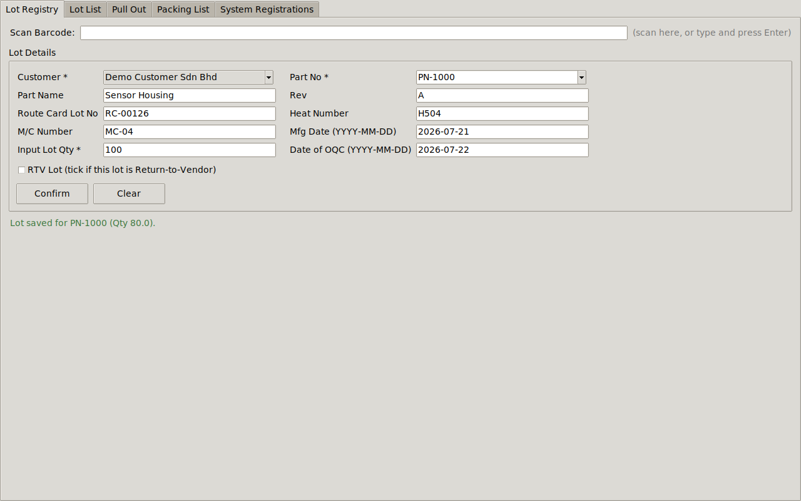
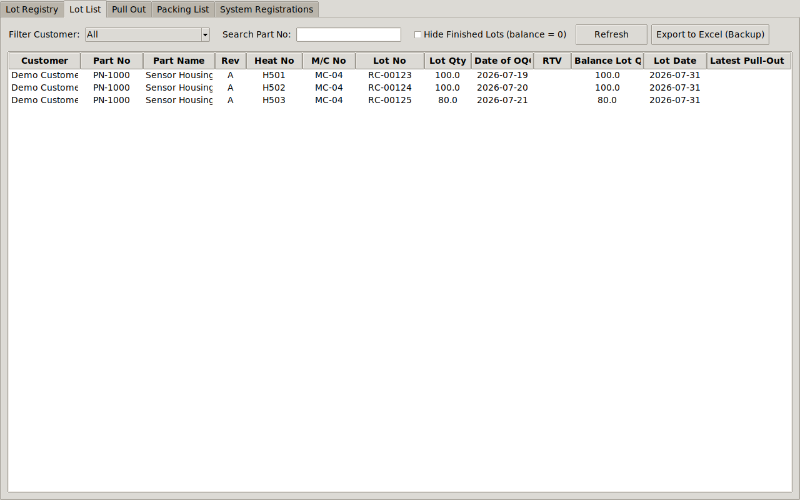
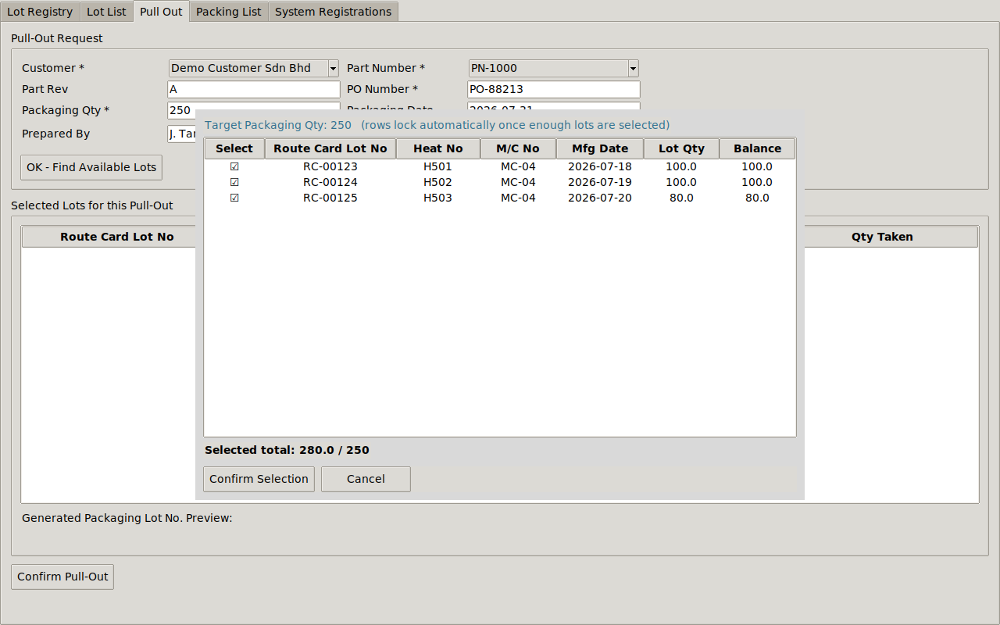
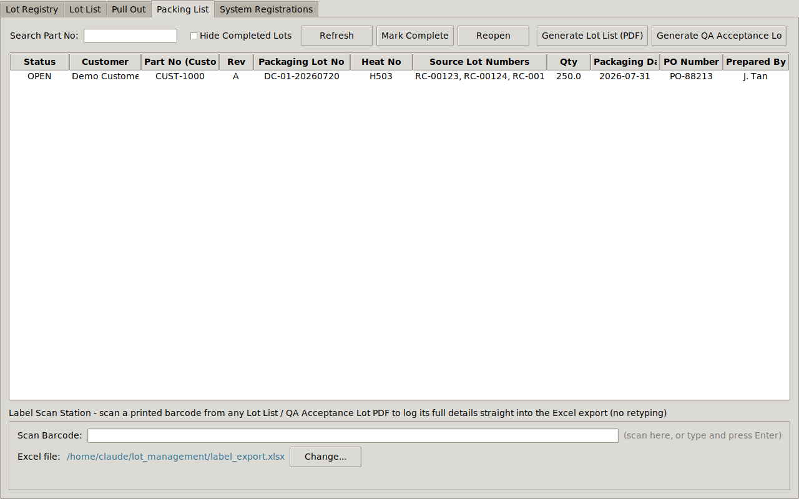
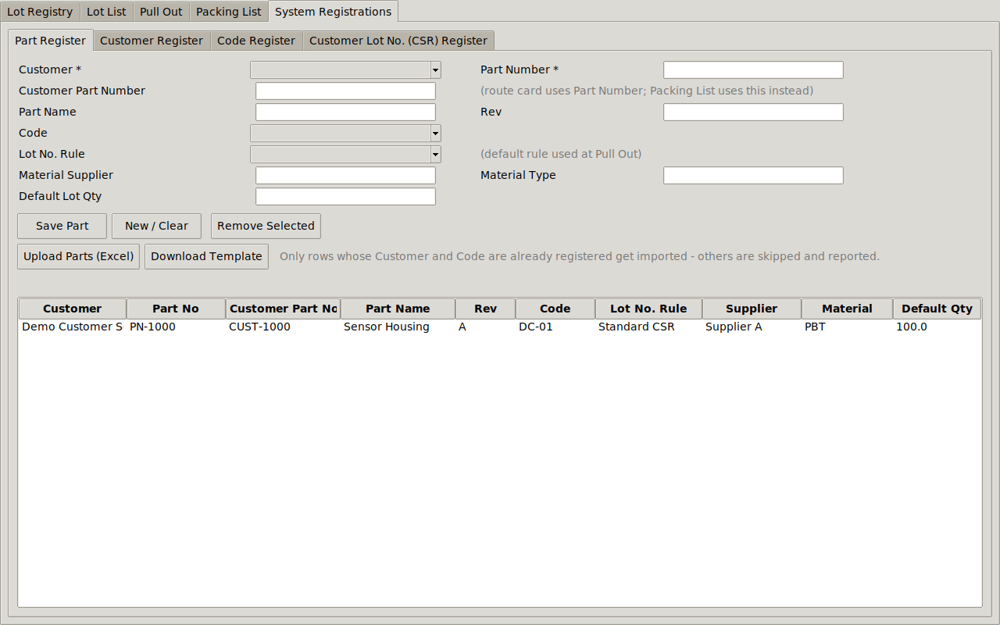

# Lot Management System

> A manufacturing lot traceability & packaging system, built to stop
> wrong lot numbers from reaching customers.


## Why I Built This

Our factory having an issue regarding wrong lot number printed during label printing. 
Lot numbers were built manually per customer, with no consistent rule and no traceability back
to the actual raw material, heat number, or machine that made the
part — so once something went out wrong, there was no fast way to
even confirm what happened, let alone prevent it next time.

I built this system to fix that at the source: every packaging lot
number is now generated automatically from a rule configured once per
customer, every shipment traces back to its exact source lots and
machine, and the same QR code that prints on the label is what
prevents the manual re-typing that caused the errors in the first
place.

**Impact so far:** With this new system I create, we manage to eliminate manual key-in by
Operator and leads to 100% accuracy of correct details required by customer during parts shipment.

## Built in 1 Day with Claude AI

The first working version — barcode scanning, the rule-based lot
number generator, PDF/QR generation, Excel integration — was built in
a single day using Claude AI, starting from a plain-English
description of the manufacturing workflow rather than a formal spec.
It then went through several rounds of real refinement afterward as it
met actual production requirements: password-protected fields,
customer-specific part numbers, a bulk Excel import, and a
customer-facing document that hides internal lot-combination details.
That combination — fast to a working prototype, then iterated against
real floor feedback — is the actual story here, not just the 1-day
part.

## Screenshots

| Lot Registry | Lot List |
|---|---|
|  |  |

| Pull Out — auto-locking lot selection | Packing List |
|---|---|
|  |  |

| System Registrations — CSR Rule Builder | Generated QA Acceptance Lot PDF |
|---|---|
|  |  |

*(All data shown is generic demo data — no real customer or shipment
information.)*

## Demo Video

[Record a 2-3 minute screen capture walking through: scan a lot in →
Pull Out with auto-lock → generate the QA Acceptance Lot PDF → scan
the QR. Upload to YouTube (unlisted is fine) or Loom, then replace this
line with:]

```markdown
[](https://your-video-link-here)
```

## Key Features

- **Rule-based lot number generator** — every customer's packaging lot
  number format is configured visually (code, dates, machine number,
  custom separators, day-of-week codes) instead of hardcoded per
  customer
- **Auto-locking lot selection** — Pull Out picks lots FIFO and
  auto-locks once the target quantity is hit, so no one over-selects
  by hand
- **Full traceability** — every shipment links back to its exact
  source lots, heat numbers, and machine
- **QR + barcode generation** — printed on a QA Acceptance Lot PDF,
  scannable straight into Excel for the label printer, no re-typing
- **Dual document output** — a full-detail internal Lot List vs. a
  customer-facing QA Acceptance Lot that deliberately hides which
  internal lots were combined
- **Password-gated critical fields** — prevents an accidental wrong
  lot-number-rule selection during Pull Out

## Skills Demonstrated

- Translating a real, messy shop-floor process into a structured data
  model (customers → parts → lots → pull-outs, with full referential
  integrity)
- Designing a **configurable rule engine** (the CSR lot-number builder)
  instead of hardcoding business logic that was going to keep changing
- Barcode/QR generation and parsing, and integrating a desktop app with
  external tooling (label-printing software) via a shared data format
- Iterative requirements gathering — this system went through many
  rounds of real refinement driven by actual production use, not a
  single upfront spec
- Working effectively with an AI coding assistant: describing
  requirements clearly, reviewing generated code, and catching/fixing
  real bugs together rather than accepting output blindly

## Tech Stack

| Layer | Choice | Why |
|---|---|---|
| Language | Python 3.9+ | Fast to build and iterate with, no licensing cost |
| UI | Tkinter | Ships with Python — zero extra install for end users |
| Database | SQLite | Single-file, zero-admin, appropriate for single-site scale |
| PDF/Barcode | reportlab | Generates the QA Acceptance Lot PDF, Code128 barcodes, QR codes |
| Excel | openpyxl | Bulk part import, and the label-software data hand-off |

## Roadmap

- [ ] Package as a Windows `.exe` for non-technical end users
- [ ] Central server-backed version for true multi-station concurrent use
- [ ] Formal reporting/analytics on lot cycle time and RTV rates

---

# Technical Documentation

## 1. Setup

Requires Python 3.9+ (Tkinter ships with standard Python on
Windows/macOS; on Linux install `python3-tk` via your package manager
if it's missing).

```bash
pip install -r requirements.txt
python main.py
```

On first run, `lot_management.db` is created automatically next to
`main.py`. All data lives in that single file - back it up like any
other file. If you're upgrading from an earlier copy of this app, your
existing `lot_management.db` is upgraded automatically and safely the
first time you run the new version (new columns are added without
touching your existing data).

## 2. How the barcode scanner works (Lot Registry)

A USB barcode scanner types like a keyboard and finishes with Enter.
Every scan box in the app ("Scan Barcode:") is a plain text field that
listens for Enter. Point the scanner at a barcode encoding pipe (`|`)
delimited fields in this order and it will auto-fill the form:

```
CUSTOMER|PARTNO|PARTNAME|REV|ROUTECARDLOTNO|HEATNO|MCNO|MFGDATE|QTY|DATEOFOQC
```

Example: `Globex Inc|PN-7|Gear Housing|B|RC5001|H10|MC1|2026-07-10|50|2026-07-12`

Any missing trailing fields (including Qty and Date of OQC) are simply
left blank so you can also encode shorter barcodes and finish manually.
In practice, the Route Card QR typically only carries the first 8
fields (`CUSTOMER|PARTNO|PARTNAME|REV|ROUTECARDLOTNO|HEATNO|MCNO|MFGDATE`)
since Input Lot Qty and Date of OQC aren't known until OQC actually
inspects the lot - OQC scans the QR to auto-fill everything else, then
types those last two fields in by hand before clicking Confirm. You can
just as easily type into the same box and press Enter instead of
scanning. If your factory's barcodes use a different layout, edit
`SCAN_FIELD_ORDER` / `parse_scan_payload()` in `app/scan_utils.py`.

(This is separate from the Lot List / QA Acceptance Lot barcode/QR
format used in the Packing List tab - see sections 5/6 below.)

## 3. Tabs (left to right)

**Lot Registry, Lot List, Pull Out, Packing List, System Registrations**
(the old numbered "1. / 2. / 3. ..." prefixes and the "Master
Registrations" name are gone - System Registrations now sits last
since it's setup/admin work, not part of the daily flow).

## 4. Recommended setup order

1. **System Registrations > Customer Register** - add each customer.
   Select a row and use **Remove Selected** to delete one (blocked if
   it still has codes/parts/lots referencing it).
2. **System Registrations > Code Register** - add customer/supplier
   codes with descriptions. Removable the same way (blocked if a part
   still uses that code).
3. **System Registrations > Part Register** - register every part
   (Customer + Part No + Rev must be unique). A lot **cannot** be
   registered in Lot Registry until its part exists here.
   - **Customer Part Number** sits right after Part Number: the
     internal Part Number is what route cards / Lot Registry / Lot
     List / Pull Out track by, while the **Packing List uses the
     Customer Part Number** instead (falls back to the internal number
     if none is set) - covers the common case where your route card
     numbering differs from what the customer expects on the paperwork.
   - **Editing**: click a row in the table to load it into the form
     (even the Part Number itself becomes editable); click **Save
     Part** / **Update Part** to save the change, or **New / Clear**
     to go back to registering a brand new part.
   - **Lot No. Rule**: pick the customer's default CSR rule here - the
     Pull Out tab locks to this by default (see below).
   - **Remove Selected** deletes a part (blocked if lots exist for it).
   - **Upload Parts (Excel)** mass-registers parts from a spreadsheet.
     **Download Template** gives you the exact expected columns:
     Customer, Part Number, Customer Part Number, Part Name, Rev, Code,
     Material Supplier, Material Type, Default Lot Qty, Lot No Rule.
     A row is only imported if its Customer is already in the Customer
     Register **and** its Code is already in that customer's Code
     Register - anything else is skipped, and you get a summary of
     exactly how many rows were imported vs. skipped and why.
4. **System Registrations > Customer Lot No. (CSR) Register** -
   build the packaging lot-number format per customer by adding
   components **in the exact order they should appear**. Click
   **Refresh** any time to re-pull customers/codes/rules if you added
   something in another tab while this one was already open.
   - **Code (from Code Register)** - pick one of that customer's
     registered codes from the dropdown. A grey `= description` label
     appears next to it (e.g. `1PY` -> `= Port`) purely so whoever is
     building the rule can tell what the code means - it's just a
     helper label and is never part of the generated lot number.
   - **Mfg Date** and **Date of OQC** - pull from the first/last
     selected lot, with a choice of formats: `D`, `DD`, `M`, `MM`,
     `MMM`, `YY`, `YYYY`, plus the combined presets `YYYYMMDD`,
     `DDMMYYYY`, `YYMMDD`, `YYYY-MM-DD`.
   - **Date of OQC 2 (Day Code)** - derives a single letter from the
     Date of OQC's day of week: `A`=Mon, `B`=Tue, `C`=Wed, `D`=Thu,
     `E`=Fri, `F`=Sat or Sun. If the selected lot has no Date of OQC
     recorded at all, this renders `G` (Rework) instead, on the
     assumption that a lot without an OQC date hasn't been through
     normal OQC yet. Flag if you'd rather this be driven by an
     explicit "Rework" flag on the lot instead of a missing date.
   - **Week No**, **Year** - pull from the first/last selected lot,
     with their own format choices.
   - **Route Card Lot No** - pull from the first/last selected lot;
     "Keep last N" truncates to the last N characters.
   - **M/C Number** - pull from the first/last selected lot.
   - **Month Code (A-M)** - A=Jan ... M=Dec (I is skipped), based on
     the first/last selected lot's Mfg Date.
   - **Country Code (M/S/T)** - Malaysia/Singapore/Thailand, picked
     once when you configure the rule.
   - **Custom / Separator** - free-text component. This is how you add
     `-`, `/`, or any fixed word, exactly where you want it in the
     sequence - there's no separate global "separator" field; just
     drop a Custom component between any two others.
   - Watch the **Live Preview** update as you configure it, then
     **Save Rule**. **Delete This Rule** removes whichever rule is
     selected in "Existing Rules".
5. **Lot Registry** - scan or key in daily incoming/WIP lots. The
   **Part No** field accepts either the internal Part Number *or* the
   Customer Part Number - whichever you type or scan, it resolves to
   the right part and normalizes the field to the internal number (so
   everything downstream keeps tracking by the same key). Two other
   fields sit after Input Lot Qty: **Date of OQC**, and an **RTV Lot**
   tick box - check it if the lot is a Return-to-Vendor lot.
6. **Lot List** - live inventory view, showing each lot's Date of OQC,
   M/C No, and RTV status.
   - **Search Part No** filters as you type.
   - **Hide Finished Lots** is the single control for showing/hiding
     lots with balance = 0 - tick it to hide them, untick to show them
     again.
   - **Export to Excel (Backup)** dumps every lot (regardless of any
     filter) to a plain spreadsheet - a record-keeping backup, separate
     from the label-data export used by Packaging.
7. **Pull Out**:
   - Selecting a Part locks the **Lot No. Rule** to that part's
     registered default (from the Part Register) - the dropdown starts
     disabled with a padlock button next to it. Click **Unlock**,
     enter the password (`12345`), and it becomes selectable so an
     authorized person can override it for this one pull-out. Changing
     the Customer or Part re-locks it back to that part's own default.
   - Fill in PO / Packaging Qty, click **OK - Find Available Lots**.
   - In the lot picker, tick lots (oldest first / FIFO order). Once
     the running total meets your target quantity, the remaining
     unticked rows **auto-lock**.
   - If total available stock is *less* than your target quantity, you
     can still tick every available lot and confirm - the **Packaging
     Qty auto-adjusts down** to whatever was actually achievable, so
     the record matches reality instead of overstating it.
   - Confirm, review the generated **Packaging Lot Number** preview,
     then **Confirm Pull-Out**.
8. **Packing List**:
   - **Search Part No** and **Hide Completed Lots** filter the table.
   - **Heat No** column shows the heat number of the *last* selected
     source lot for that packaging lot (same "last wins" convention
     used throughout the CSR rule engine).
   - **Mark Complete / Reopen** closes or reopens a packaging lot.
   - **Generate Lot List (PDF)** - the full internal-use document
     (title "Lot List"): includes the Packaging Lot Barcode, the full
     Source Lot Detail table (each source lot with its own barcode),
     and a master QR that includes which source lots were combined.
   - **Generate QA Acceptance Lot (PDF)** - the customer-facing
     document (title "QA Acceptance Lot"): same header info, but
     leaves out the Packaging Lot Barcode section and the Source Lot
     Detail table, and its master QR omits which source lots were
     combined - so a customer scanning it can't tell that multiple
     internal WIP lots were merged into the shipment.
   - **Export to Label Excel** - writes every source-lot line item of
     the selected pull-out into the label-data spreadsheet (see
     section 6).
   - **Export Log to Excel (Backup)** - dumps the entire pull-out
     history (regardless of any filter) to a plain spreadsheet, for
     record-keeping - separate from the label-data export above.
   - **Label Scan Station** - scan a barcode straight off a printed
     Lot List or QA Acceptance Lot PDF and its full details are
     appended to the label-data Excel file automatically, no retyping.

## 5. Lot List PDF vs. QA Acceptance Lot PDF

The Packing List tab generates two different documents from the same
pull-out record:

- **Lot List (PDF)** - the full internal-use document. Title "Lot
  List". Has the master QR (top-right, includes which source lots were
  combined), a Packaging Lot Barcode, and a full Source Lot Detail
  table where every source lot gets its own Code128 barcode encoding
  that line's complete detail set.
- **QA Acceptance Lot (PDF)** - the customer-facing document. Title
  "QA Acceptance Lot". Same header block (Customer, Part No, Rev, PO,
  Packaging Qty, Packaging Date, Prepared By, Heat No, Packaging Lot
  No) and the same master QR position, but the Packaging Lot Barcode
  section and the Source Lot Detail table are both left out, and the
  QR itself omits the source-lot breakdown - so a customer scanning it
  has no way to tell that multiple internal WIP lots were merged into
  this shipment.

Because the per-line barcodes on the Lot List PDF carry many fields
instead of just a lot number, the module width auto-shrinks so the
barcode still fits on the page regardless of payload length. For very
data-heavy lines this makes for a denser barcode - Code128 is generally
best kept to short values, so if handheld scanners struggle with the
dense per-line codes, the QR is the more robust option for a
full-detail scan.

## 6. Excel export / Label Scan Station (for label-printing software)

Every "Export to Excel" click or physical barcode scan appends a row
to `label_export.xlsx` (or wherever you point it via **Change...**) in
a fixed column layout: Customer, Part No, Part Name, Rev, Packaging
Lot No, PO Number, Packaging Qty, Packaging Date, Prepared By, Source
Lot No, Heat No, M/C No, Mfg Date, Qty Taken.

Point your label software (BarTender, NiceLabel, or similar) at this
file as its data source, and it can pull whichever fields it needs for
the label template - no copy/paste. The payload format is defined once
in `app/label_payload.py` and shared by the PDF barcode/QR generator
and the Excel writer, so what gets printed and what gets logged can
never drift out of sync.

## 7. Project layout

```
lot_management/
├── main.py                     # app entry point, wires the 5 tabs together
├── requirements.txt
├── lot_management.db           # created on first run
├── label_export.xlsx           # created on first Excel export / scan
└── app/
    ├── database.py              # SQLite schema + all CRUD helpers (+ migrations)
    ├── lot_number_generator.py  # rule-based packaging lot-number engine
    ├── label_payload.py         # shared barcode/QR/Excel payload format
    ├── excel_export.py          # Excel append/export for label software
    ├── pdf_generator.py         # packing list PDF, Code128 barcodes + QR
    ├── scan_utils.py            # barcode-scan entry widget & payload parser
    ├── tab1_lot_registry.py
    ├── tab2_master.py           # Part / Customer / Code / CSR sub-tabs
    ├── tab3_lot_list.py
    ├── tab4_pullout.py          # includes the lot-selection auto-lock window
    └── tab5_pullout_list.py
```

## 8. Notes & things you may want to extend

- The Lot No. Rule lock password (`12345`, set in `RULE_CHANGE_PASSWORD`
  at the top of `app/tab4_pullout.py`) is a soft deterrent against
  accidental wrong-rule selection, not real access control - it's
  plain text in the source and anyone with the file can read or change
  it. If you need actual per-user authorization, that needs a proper
  login/roles system layered on top.

- The database file is local SQLite; for multi-user/networked use
  you'd want to swap it for a client-server database and add a login
  layer - the `database.py` module isolates all SQL so that's a
  contained change.
- Pull-out lot selection currently orders lots FIFO by scan date; if
  you need a different picking strategy (e.g. by heat number), adjust
  `list_lots()` in `database.py`.
